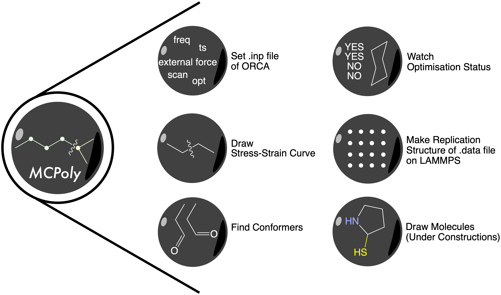

# MCPoly
Some methods to deal with some manipulation of computational chemistry, mostly about mechanical properties of polymers.

## Overview
`MCPoly` is a Python library to make some steps of computational chemistry easier. It includes some functions of drawing molecule structures, creating proper .xyz , .inp , .mol and .data file, which specialised for using ORCA and LAMMPS, and some functions for researching the mechanical property of some polymers.

## Functions for ORCA

### orcaset
Used to create ORCA input files and run it on ORCA. It's especially handy for researching mechanical property of polymers.

### status
Because we can't use ORCA to visualize the geometry structure, this command can be used to see the optimisation status and the trait of geometry structure.

### view3d
See the 3D structure of a normal .xyz file.

### sscurve
With calculated .xyz file, we can draw the stress-strain curve of each polymer, and we can also calculate the Young's modulus of relevant polymers.

### moldraws (Under Construction)
Used to build a simple molecule and save it under .xyz form.

## Functions for LAMMPS

### lmpset
Used to draw special patterns of polymers. Mostly in grids.

## Installation
To get `MCPoly`, you can install it with pip:
    `$ pip install MCPoly`

If you want to get the latest version of `MCPoly`, you can see the latest release here:

<https://github.com/Omicron-Fluor/MCPoly/release> 

There will be a corresponding release on `pip` for each release on GitHub, and you can update your `MCPoly` with:

`$ pip install MCPoly --upgrade`

## How to cite
<https://github.com/Omicron-Fluor/MCPoly>

## Outlook
We will add some new function about polymers based on ReaxFF.
